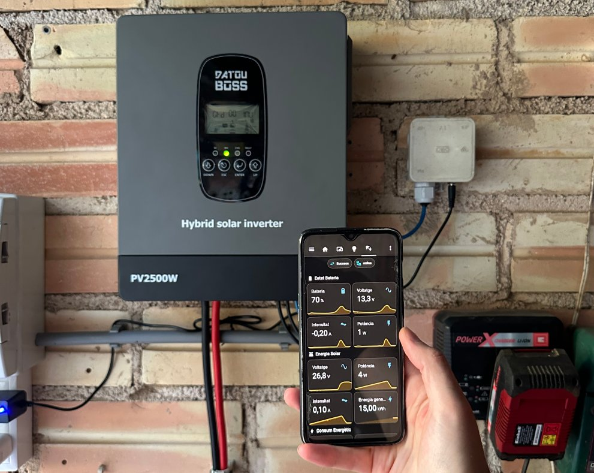
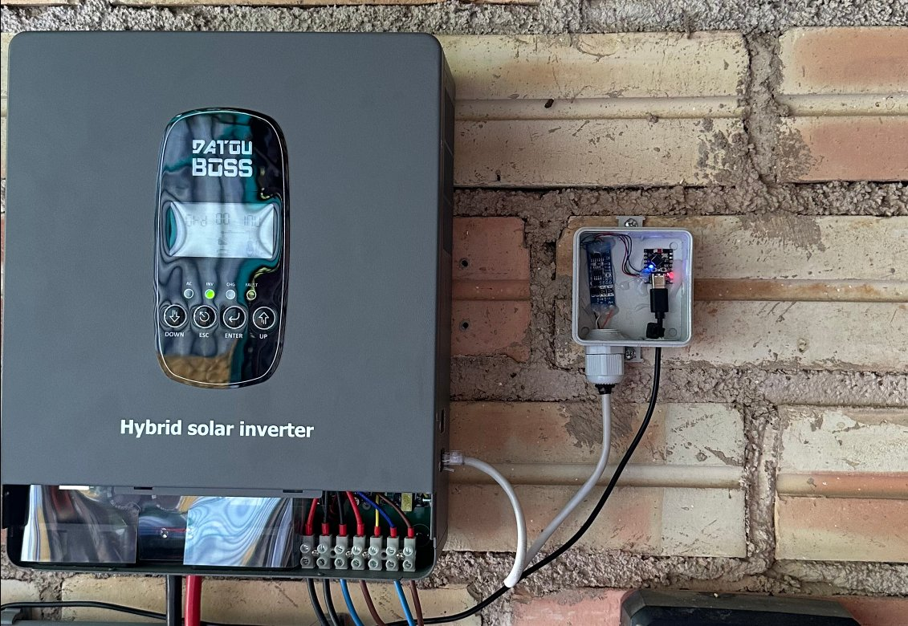

# datouboss-modbus-mqtt

This firmware runs in an ESP32-C3 that reads a **DATOUBOSS DT-1218M-A** hybrid solar inverter over its RS485 (Modbus RTU) port and publishes the data to Home Assistant over MQTT. All sensors appear in Home Assistant automatically through MQTT discovery.



DATOUBOSS does not publish the inverter's Modbus register map. The registers below were discovered by probing the inverter, and each one is marked with the confidence level recorded during that discovery. Each register is also linked to the page of the inverter's LCD that shows the same value, so you can check it yourself.

- [The inverter](#the-inverter)
- [How it works](#how-it-works)
- [Hardware and wiring](#hardware-and-wiring)
- [Communication parameters](#communication-parameters)
- [Register map](#register-map)
- [MQTT interface](#mqtt-interface)
- [Status LED](#status-led)
- [Reliability features](#reliability-features)
- [Building and flashing](#building-and-flashing)
- [Configuration reference](#configuration-reference)
- [Sources](#sources)

## The inverter

The DATOUBOSS DT-1218M-A is a 12 V, 1800 W pure sine wave hybrid inverter with a built-in MPPT solar charge controller. It can run off-grid, in hybrid mode, or grid-tied (feeding surplus power to the grid). Main specifications, from the DATOUBOSS user manual (section 8):

| Specification | Value |
|---|---|
| Rated output power | 1800 W |
| AC output | 220 / 230 / 240 V AC (±2 %), 50 / 60 Hz, pure sine wave |
| Battery | 12 V DC, lead-acid or lithium; voltage range 10.5–15 V |
| PV input | Maximum 2500 W, 300 V DC Voc, 15 A; MPPT range 30–240 V DC; 1 MPPT input |
| Maximum charging current | 100 A from PV, 65 A from AC, 100 A in total |
| AC input range | 165–280 V AC (or 120–280 V AC, selectable) |
| Grid-tie output | 1800 W, 187–264 V AC, power factor > 0.98 |
| Peak efficiency | 94 % |
| Transfer time | 10 ms (typical) |
| Battery protection | Low-voltage alarm at 11 V, shutdown at 10.5 V (defaults) |
| Over-temperature shutdown | Above 90 °C |
| Operating temperature | −10 to 50 °C |
| Size and weight | 310 × 250 × 91 mm, 4.0 kg |

It has two RS485 ports:

| Port | Purpose |
|---|---|
| **RS485-1** | External communication / WiFi dongle. **Connect the ESP32 here.** |
| RS485-2 | Battery BMS communication. Do not use this port for the ESP32. |

Modbus allows only one master on the bus. If you use the optional DATOUBOSS WiFi dongle (the "Solar of Things" app), unplug it while the ESP32 is connected to RS485-1.

## How it works


Every 60 seconds the ESP32:

1. Reads two blocks of holding registers from the inverter (`0x0001–0x0020` and `0x0033–0x0042`).
2. Converts the raw values into engineering units (see the [register map](#register-map)).
3. Checks that the lifetime energy counters have not gone down.
4. Publishes all inverter values as one JSON message to `stat/solar/data`.
5. Publishes device health (WiFi signal, memory, error counters, and so on) to `stat/solar/diag_data`.

If a read fails, nothing is published to `stat/solar/data` for that cycle. After 3 missed cycles (180 s), Home Assistant shows the inverter sensors as "unavailable" rather than displaying old values.

The firmware runs two FreeRTOS tasks:

| Task | Priority | What it does |
|---|---|---|
| `mainTask` | 1 | WiFi and MQTT connection handling, Home Assistant discovery, Modbus polling, publishing, and the MQTT restart command |
| `heartbeatTask` | 2 | Blinks the status LED to show the current state |

Both tasks are registered with the ESP32 task watchdog (30 s timeout). If either one hangs, the device reboots automatically.

## Hardware and wiring



The ESP32-C3 and the RS485 transceiver fit in a small junction box mounted next to the inverter. A network cable runs from the inverter's RS485-1 port (on its right side) through a cable gland into the box, and a USB-C cable powers the ESP32.

| Part | Notes |
|---|---|
| ESP32-C3 SuperMini | Built as `esp32-c3-devkitm-1` in PlatformIO. Serial output goes over the native USB port. |
| RS485 to TTL transceiver | Must switch between send and receive automatically. The firmware does not drive a DE/RE pin by default (`MODBUS_DE_RE_PIN -1`). |
| Status LED | The SuperMini's onboard LED on GPIO8, lit when the pin is LOW. |

| ESP32-C3 pin | Connects to |
|---|---|
| GPIO5 (UART1 RX) | Transceiver RO / RXD |
| GPIO4 (UART1 TX) | Transceiver DI / TXD |
| GPIO8 | Status LED (onboard) |
| 3V3 / GND | Transceiver VCC / GND (use a 3.3 V transceiver: the ESP32-C3 pins are not 5 V tolerant) |

UART0 (GPIO20 RX / GPIO21 TX) is not used because wiring the transceiver to it caused WiFi connectivity problems, presumably because those pins are close to the SuperMini's ceramic antenna. UART1 on GPIO5 and GPIO4 has had no such issues.

Connect the transceiver to the inverter's **RS485-1** port, which is an RJ45 socket. Pinout from the user manual (section 9), confirmed working with this project:

| RJ45 pin | Signal | Connect to |
|---|---|---|
| 1 | RS485 **B** | Transceiver B |
| 2 | RS485 **A** | Transceiver A |
| 4 | +5 V | Not needed (see below) |
| 8 | GND | Transceiver GND |
| 3, 5, 6, 7 | Not connected | — |

Pin 1 is B and pin 2 is A on this model. If you get no replies, check that A and B are not swapped.

Pin 4 provides +5 V, presumably to power the WiFi dongle. Never connect it to the ESP32's 3V3 pin or to a 3.3 V transceiver. The manual does not say how much current it can supply, and powering the ESP32 from it has not been tested.

If your transceiver has a DE/RE (direction) pin, wire it to a free GPIO and set `MODBUS_DE_RE_PIN` to that pin number. The firmware will then drive it high while transmitting.

## Communication parameters

| Parameter | Value |
|---|---|
| Protocol | Modbus RTU |
| Physical layer | RS485, half duplex |
| Baud rate | 9600 |
| Data format | 8 data bits, no parity, 1 stop bit (8N1) |
| Slave (unit) address | 1 (inverter setting **A27**, "communication address", default 001; must match `MODBUS_SLAVE_ADDR`) |
| Function code | `0x03` Read Holding Registers |
| Register size | 16 bits, big-endian (standard Modbus) |
| Request 1 | Start `0x0001`, 32 registers (`0x0001–0x0020`) |
| Request 2 | Start `0x0033`, 16 registers (`0x0033–0x0042`) |
| Pause between requests | 30 ms |
| Response timeout | 2000 ms (ModbusMaster library default) |
| Retries per request | 3, waiting 50 / 100 / 150 ms between attempts |
| Polling interval | 60 s |
| Bus recovery | UART and Modbus are re-initialised after 5 consecutive failed reads |

Before each request the firmware discards any stray bytes left in the UART receive buffer, so a late or partial reply cannot corrupt the next one.

## Register map

All registers are holding registers, read with function code `0x03`. Addresses are the zero-based addresses sent on the wire.

**How to read the "Conversion" column:** `raw` is the 16-bit register value. For example, `raw / 10` means a raw value of `523` is 52.3. Registers marked **signed** are read as 16-bit two's complement (`int16`), so a raw value of `65 516` means −20.

**Confidence** is the level recorded for each register during discovery: **Very high**, **High** or **Low**. Registers whose meaning has not been checked thoroughly are listed separately as **Not rated**.

**LCD page** is the page of the inverter's display that shows the same value (user manual, section 4-5). Step through the pages with the UP and DOWN buttons to compare a register with the display.

### Block 1: `0x0001–0x0020`

| Register | Description | Conversion | Unit | JSON key | LCD page | Confidence |
|---|---|---|---|---|---|---|
| `0x0002` | AC output voltage | raw | V | `aov` | 01 | Very high |
| `0x0004` | DC bus voltage | raw / 10 | V | `busv` | 07 | Very high |
| `0x0005` | AC input (grid) voltage | raw | V | `aiv` | 02 | Low |
| `0x0007` | AC input (grid) current | raw / 10 | A | `aic` | 08 | Low |
| `0x0008` | Battery voltage | raw / 10 | V | `bv` | 03 | Very high |
| `0x0009` | DC bus current | **signed**, raw / 100 | A | `busc` | 07 | High |
| `0x000A` | MPPT heatsink temperature (no sensor fitted, reads 24–25 °C) | **signed**¹, raw | °C | `mt` | 17 | Very high |
| `0x000B` | PV1 current | raw / 10 | A | `pv1c` | 14 | High |
| `0x000C` | PV1 voltage | raw / 10 | V | `pv1v` | 14 | High |
| `0x000F` | DC/DC heatsink temperature | **signed**¹, raw | °C | `dt` | 18 | Very high |
| `0x0010` | Inverter heatsink temperature | **signed**¹, raw | °C | `it` | 17 | Very high |
| `0x0011` | Battery current: positive when charging, negative when discharging | **signed**, raw / 10 | A | `bc` | 03 | Very high |
| `0x0012` | AC input (grid) frequency | raw / 10 | Hz | `aif` | 02 | Low |
| `0x0013` | Load, as a percentage of rated output | raw | % | `lp` | 12 | Very high |
| `0x0020` | Load power | raw | W | `lw` | 12 | Very high |

### Block 2: `0x0033–0x0042`

| Register | Description | Conversion | Unit | JSON key | LCD page | Confidence |
|---|---|---|---|---|---|---|
| `0x0033` | Battery state of charge | raw | % | `soc` | 06 | Very high |
| `0x0037` | PV1 power | raw | W | `pv1p` | 15 | High |
| `0x0039` | PV1 generation, lifetime total | raw | kWh | `pg` | 15 | Low² |
| `0x003B` | AC charging power | raw | W | `acp` | 11 | Low |
| `0x003E` | Battery power (always positive) | raw | W | `bp` | 04 / 05³ | High |
| `0x003F` | Battery charge energy, lifetime total | raw | kWh | `bce` | 05 | Low² |
| `0x0040` | Battery discharge energy, lifetime total | raw | kWh | `dc` | 04 | Low² |
| `0x0041` | Load consumption energy, lifetime total | raw | kWh | `le` | 13 | Low² |
| `0x0042` | AC input (grid) power | raw | W | `aip` | 10 | Low |

¹ Read as signed so that temperatures below 0 °C come through correctly. For positive values the result is the same as unsigned. The sign convention has not been confirmed on the inverter. The display and the fault codes (55 inverter heatsink, 56 DC/DC heatsink, 57 MPPT heatsink) confirm there are three temperature readings. However, a [teardown of the DT-1218M](https://mysku.club/blog/diy/108781.html) (in Russian) found positions for 3 NTC sensors with only 2 fitted. The MPPT heatsink has no sensor connected, so `0x000A` stays between 24 and 25 °C regardless of load, which is not a real heatsink measurement.

² Confirmed to be lifetime totals in 1 kWh steps. A 16-bit register can count up to 65 535 kWh before wrapping back to zero. The counters can be cleared from the inverter's menu with setting **A29** ("power generation reset"); see [Reliability features](#reliability-features) for how the firmware handles that.

³ The display shows battery discharge power on page 04 and battery charge power on page 05, as two separate values. This register is always positive: it gives the battery power whether the battery is charging or discharging. The direction comes from the battery current (`0x0011`): positive means charging, negative means discharging.

### Registers not checked thoroughly

These registers have a probable meaning, but it has not been checked thoroughly. The firmware does not use or publish them.

| Register | Probable meaning | Conversion | Confidence |
|---|---|---|---|
| `0x0015` | Inverter active flag | raw | Not rated |
| `0x0016` | PV / MPPT active flag | raw | Not rated |
| `0x0017` | Configuration bit (inverter) | raw | Not rated |

### Registers read but not decoded

These addresses are inside the blocks the firmware reads, but their meaning is unknown:

- Block 1: `0x0001`, `0x0003`, `0x0006`, `0x000D`, `0x000E`, `0x0014`, `0x0018–0x001F`
- Block 2: `0x0034–0x0036`, `0x0038`, `0x003A`, `0x003C`, `0x003D`

To explore them, add a `DEBUG_PRINTF` of `charger.getResponseBuffer(index)` in `readInverterRegisters()`. Then compare the values with the inverter's display while its operating state changes (sun on and off, grid on and off, load on and off).

### Display values with no register identified yet

The inverter's display shows these values, so they must be stored somewhere, but no register has been matched to them yet. They are the best targets for further mapping:

| LCD page | Value |
|---|---|
| 01 | AC output frequency |
| 06 | Remaining battery capacity, Ah (only shown with a lithium battery connected through the BMS) |
| 08 | Inverter internal converter current |
| 09 | Grid-tie (export) power, and grid-tie generation in kWh |
| 10 | AC input energy, kWh |
| 11 | AC charging energy, kWh |
| 13 | Load current |
| 18 | Software version |
| — | Active fault code (codes 40–68, listed in the manual, section 5) |

## MQTT interface

### Topics

| Topic | Direction | Retained | Content |
|---|---|---|---|
| `stat/solar/data` | Device → broker | Yes | Inverter values as JSON (keys listed in the [register map](#register-map)) |
| `stat/solar/diag_data` | Device → broker | Yes | Device health as JSON (see below) |
| `stat/solar/availability` | Device → broker | Yes | `online` when connected; `offline` on a clean restart or, through the MQTT last will, when the connection is lost |
| `cmnd/solar/restart` | Broker → device | No | Payload `1` restarts the device |
| `homeassistant/status` | Broker → device | (HA's own) | When Home Assistant publishes `online`, the device re-sends its discovery messages |
| `homeassistant/sensor/<id>…/config`<br>`homeassistant/button/<id>…/config` | Device → broker | Yes | Home Assistant discovery messages |

`<id>` is the device ID, `SolarGW-` followed by the last three bytes of the ESP32's MAC address (for example `SolarGW-A1B2C3`). It is also used as the MQTT client ID.

### Example `stat/solar/data` message

The values below are made up, to show the format.

```json
{"bv":13.1,"soc":85,"aov":230,"busv":380.5,"busc":1.25,"bc":-12.4,"bp":162,
 "pv1v":145.2,"pv1c":6.1,"pv1p":885,"pg":1234,"lw":610,"lp":12,"mt":38,"it":41,
 "dt":36,"aiv":231,"aic":0.4,"aif":50.0,"aip":92,"acp":0,"bce":2210,"dc":1980,"le":4321}
```

### Diagnostic values (`stat/solar/diag_data`)

| Key | Description |
|---|---|
| `ip` | IP address |
| `rssi` | WiFi signal strength (dBm) |
| `heap` | Free heap (bytes) |
| `mblk` | Largest free heap block (bytes) |
| `frag` | Heap fragmentation (%) |
| `wrc` | WiFi reconnects since boot |
| `mqrc` | MQTT reconnects since boot |
| `ms` | Result of the last Modbus read (`Success`, `Timeout`, `Invalid CRC`, `Implausible data`, …) |
| `mok` | Successful Modbus reads since boot |
| `mer` | Failed Modbus reads since boot |
| `rr` | Reason for the last reset (`Power-on`, `Software`, `Task WDT`, `Brownout`, …) |

### Home Assistant entities

Discovery creates one device, "Solar Inverter", with:

- one sensor for each published register, with the correct device class, unit and state class. The four lifetime energy counters use `total_increasing`, so they work directly in the Energy dashboard;
- diagnostic sensors for every key in `diag_data`, plus a device availability sensor;
- a **Restart Device** button.

The inverter sensors expire after 180 s without new data, so they show "unavailable" while Modbus is failing.

## Status LED

The onboard LED repeats a pattern every 2 seconds:

| Pattern | Meaning |
|---|---|
| 1 short blink | Everything OK |
| 2 short blinks | WiFi is connected, but MQTT is not |
| 3 short blinks | MQTT is connected, but the last Modbus read failed |
| Fast continuous blinking | WiFi is not connected (this is normal for a few seconds after boot) |

If the LED stays permanently on or off, the firmware has hung. The watchdog will reboot the device within 30 s.

## Reliability features

- **Watchdog:** a 30 s task watchdog covers both tasks. Network timeouts are kept short (8 s TCP connect, 8 s TLS handshake, 5 s MQTT reply), so a broker that is down never trips it.
- **WiFi recovery:** the WiFi driver's own auto-reconnect handles normal drops. If WiFi is still down after 30 s, the firmware forces a fresh connection attempt, and it reboots after 3 minutes without WiFi.
- **MQTT recovery:** reconnects automatically. On a reconnect the availability topic is set back to `online` and the subscriptions are renewed.
- **Discovery:** sent at boot and whenever Home Assistant restarts. If any message fails, the whole set is retried every 60 s.
- **No false data:** values are published only after both register blocks have been read successfully. Nothing is published before the first successful read, so Home Assistant never sees zeros at boot.
- **Energy counter check:** the lifetime counters can only go up. If a read shows a lower value, it is discarded (`ms` = `Implausible data`), because Home Assistant would treat the drop as a meter reset and count the energy twice. If the lower value appears 3 reads in a row, it is accepted, since the counters may really have been reset on the inverter (setting A29). After such a reset, Home Assistant's long-term energy statistics continue from where they were. A wrap from near 65 535 back to a small number is accepted straight away.
- **Safe restart command:** only the payload `1` is accepted. Commands received in the first 5 s after connecting are ignored, so a retained message on the command topic cannot cause a reboot loop.
- **Oversized message check:** JSON that would not fit the 768-byte MQTT buffer is not published (an error is logged), instead of being sent cut off.

## Building and flashing

Requires [PlatformIO](https://platformio.org/), either the VS Code extension or the CLI.

1. Create your credentials file:
   ```bash
   cp include/secrets.h.example include/secrets.h
   ```
   `include/secrets.h` is ignored by git, so your credentials stay local.
2. Edit `include/secrets.h`:
   - `WIFI_SSID` and `WIFI_PASSWORD`
   - `MQTT_BROKER`, `MQTT_PORT` (8883 for TLS), `MQTT_USER` and `MQTT_PASSWORD`
   - `MQTT_CA_CERT`: your broker's CA certificate in PEM format. This is recommended, because it lets the device verify that it is talking to your broker.
   - If you cannot provide a CA certificate, add `#define MQTT_ALLOW_INSECURE`. The connection is still encrypted, but the broker's identity is not checked. Without either one, the device will not connect to MQTT.
3. Build and upload over USB:
   ```bash
   pio run -t upload
   pio device monitor        # 115200 baud, optional
   ```

Libraries (installed automatically by PlatformIO): ModbusMaster 2.x, PubSubClient 2.8, ArduinoJson 7.x.

## Configuration reference

These settings are `#define`s at the top of `src/main.cpp`:

| Setting | Default | Meaning |
|---|---|---|
| `PUBLISH_INTERVAL_MS` | 60 000 | How often the inverter is polled and data published |
| `MODBUS_BAUD` | 9600 | RS485 baud rate |
| `MODBUS_SLAVE_ADDR` | 1 | Inverter's Modbus address |
| `MODBUS_RX_PIN` / `MODBUS_TX_PIN` | 5 / 4 | UART pins for the transceiver |
| `MODBUS_DE_RE_PIN` | -1 | Direction pin for transceivers without automatic switching (-1 = not used) |
| `HEARTBEAT_PIN` / `HEARTBEAT_ACTIVE_LOW` | 8 / 1 | Status LED pin and polarity (can also be overridden in `secrets.h`) |
| `WIFI_RETRY_INTERVAL_MS` | 30 000 | How long WiFi can be down before the firmware forces a new connection attempt |
| `WIFI_RESET_AFTER_MS` | 180 000 | Reboot after this long without WiFi |
| `MQTT_BUFFER_SIZE` | 768 | Maximum MQTT message size (topic + payload) |
| `ENABLE_SERIAL_DEBUG` | 1 | Set to 0 to turn off serial logging |

## Sources

- DATOUBOSS DT-1218M-A user manual (SP-DT-1218M-A-EU, English), supplied with the inverter: specifications, RS485 pinout, LCD pages, settings and fault codes. An online copy is on [manuals.plus](https://manuals.plus/ae/1005010338599262).
- [Correction of the cooling control circuit of the DATOUBOSS DT-1218M](https://mysku.club/blog/diy/108781.html) (mysku.club, in Russian): teardown with details of the temperature sensors

## License

Apache License 2.0, see [LICENSE](LICENSE).
